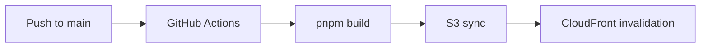

# CLOSM Docs

CLOSM のドキュメントポータル。複数プロダクトのドキュメントを集約管理。

**URL**: https://docs.closm.llc/

## Quick Start

```bash
pnpm install    # Install dependencies
pnpm dev        # Start dev server (http://localhost:4321)
pnpm build      # Production build
```

## Tech Stack

| Category | Tool |
|----------|------|
| Framework | [Starlight](https://starlight.astro.build/) (Astro) |
| Theme | [Ion](https://github.com/HiDeoo/starlight-ion-theme) |
| Search | Pagefind |
| Hosting | AWS S3 + CloudFront |
| CI/CD | GitHub Actions |

## Directory Structure

```
closm-docs/
├── .github/workflows/deploy.yml   # CI/CD pipeline
├── infrastructure/                # AWS config templates
│   ├── cloudfront/url-rewrite.js  # CloudFront Function
│   ├── iam/deploy-policy.json     # IAM policy reference
│   └── s3/bucket-policy.json      # S3 policy reference
├── src/
│   ├── content/docs/              # Documentation content
│   │   ├── index.md               # Portal (English)
│   │   ├── i/                     # CLOSM i docs
│   │   └── ja/                    # Japanese translations
│   └── styles/custom.css          # Typography settings
├── astro.config.mjs               # Starlight config
└── package.json
```

## URL Structure

| Path | Content |
|------|---------|
| `/` | Portal (English, default) |
| `/i/` | CLOSM i documentation |
| `/ja/` | Japanese translations |

## Deployment



### GitHub Secrets

| Secret | Value |
|--------|-------|
| `AWS_ACCESS_KEY_ID` | GithubActionsExecuter |
| `AWS_SECRET_ACCESS_KEY` | GithubActionsExecuter |
| `AWS_REGION` | `ap-northeast-1` |
| `AWS_S3_BUCKET_NAME` | `closm-docs-prod` |
| `CLOUDFRONT_DISTRIBUTION_ID` | `EADR14ROCZOLB` |

### AWS Resources

| Resource | ID |
|----------|-----|
| S3 Bucket | `closm-docs-prod` |
| CloudFront Distribution | `EADR14ROCZOLB` |
| CloudFront Function | `closm-docs-url-rewrite` |
| OAC | `E3Q93NYUT5E9J7` |

### CloudFront Function Update

```bash
# Update function (when url-rewrite.js changes)
aws cloudfront update-function \
  --name closm-docs-url-rewrite \
  --function-config Comment="URL rewrite for static site",Runtime=cloudfront-js-2.0 \
  --function-code fileb://infrastructure/cloudfront/url-rewrite.js \
  --if-match <ETAG>

# Publish
aws cloudfront publish-function --name closm-docs-url-rewrite --if-match <ETAG>
```

## Adding New Products

1. Create `src/content/docs/<product>/` directory
2. Add sidebar group in `astro.config.mjs`
3. Add Japanese translation in `src/content/docs/ja/<product>/`

## i18n

- **Default**: English (no URL prefix)
- **Japanese**: `/ja/` prefix

## References

- [Starlight Documentation](https://starlight.astro.build/)
- [Astro Documentation](https://docs.astro.build/)
