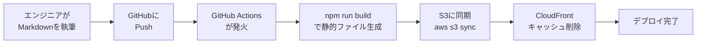

# CLOSM Docs

CLOSMのドキュメントサイトです。複数プロダクトのドキュメントを集約管理する企業向けドキュメントポータルです。

## 概要

### 目的

- **エンジニア主導**: Markdownで執筆し、Gitでバージョン管理
- **エンドユーザー向け**: 検索機能と親しみやすいUIで使いやすいドキュメント
- **低コスト運用**: S3 + CloudFrontで静的ホスティング

### 技術スタック

- **フレームワーク**: [Docusaurus](https://docusaurus.io/) (v2/v3)
- **ホスティング**: AWS S3 + CloudFront
- **CI/CD**: GitHub Actions

## 選定理由

### Docusaurusを選んだ理由

| 要件 | Docusaurusの対応 |
|------|------------------|
| **エンジニア執筆** | Markdown (MDX) で記述可能。Reactコンポーネントを埋め込めるため、リッチなUIを実現可能 |
| **エンドユーザー向け** | Algolia等の検索プラグイン標準対応。CSS/Reactで自由にカスタマイズ可能 |
| **低コスト運用** | 完全な静的出力。S3+CloudFrontの従量課金のみでランニングコストはほぼゼロ |

## サイト構成

### URL構造

```
docs.closm.llc/
├── /                    # ポータルページ（全プロダクトへの入り口）
├── /i/                  # CLOSM i のドキュメント
│   ├── /intro           # イントロダクション
│   └── /tutorial        # チュートリアル
└── /product-b/          # 将来のプロダクトB用
    └── ...
```

### ディレクトリ構成（予定）

```
closm-docs/
├── docusaurus.config.js
├── src/
│   └── pages/
│       └── index.js      # ポータルページ（各プロダクトへのリンク）
└── docs/
    ├── i/                # CLOSM i 用のドキュメント
    │   ├── intro.md
    │   └── tutorial.md
    └── product-b/        # 将来のプロダクト用
        └── ...
```

## デプロイフロー



### デプロイ手順（予定）

1. エンジニアがMarkdownを書いてGitHubにPush
2. GitHub Actions等のCIが発火
3. `npm run build` で静的ファイルを生成
4. AWS CLI等でS3に同期 (`aws s3 sync ./build s3://my-bucket`)
5. CloudFrontのキャッシュ削除 (`aws cloudfront create-invalidation ...`)

## 開発方針

- **モノレポ管理**: 全プロダクトのドキュメントを1つのリポジトリで管理
- **集約型（Centralized）**: 1つのサブドメイン（`docs.closm.llc`）に全ドキュメントを集約
- **拡張性**: 将来のプロダクト追加に対応可能な構成

## 参考リンク

- [Docusaurus公式ドキュメント](https://docusaurus.io/)
- [Docusaurus GitHub](https://github.com/facebook/docusaurus)
