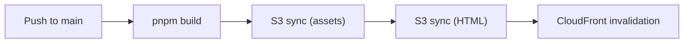

# Deployment

## Environment

| Item | Value |
|------|-------|
| URL | https://docs.closm.llc |
| Branch | `main` |
| S3 Bucket | `closm-docs-prod` |

---

## Deploy Commands

```bash
# Deploy (push to main triggers auto-deploy)
git push origin main

# Check status
gh run list --repo CLOSM-org/closm-docs --limit 1

# View logs
gh run view <run-id> --log
```

---

## AWS Resources

### CloudFront Distribution

| Item | Value |
|------|-------|
| Distribution ID | `EADR14ROCZOLB` |
| Domain | `dpj5xk7mwl5ld.cloudfront.net` |
| Function | `closm-docs-url-rewrite` |
| OAC | `E3Q93NYUT5E9J7` |

### Shared Resources

| Resource | ID/Name |
|----------|---------|
| ACM Certificate | `210ea1cd-9aa2-41ec-b77f-b83e61285e6e` (*.closm.llc) |
| Route53 Zone | `Z0999037DBL3RDOQMY8B` |
| IAM User | `GithubActionsExecuter` |
| IAM Policy | `GitActionDeployReactForS3` (v5) |

---

## CI/CD Pipeline

**Workflow**: `.github/workflows/deploy.yml`



### Two-Phase S3 Sync

| Phase | Files | Cache-Control |
|-------|-------|---------------|
| 1 | CSS, JS, images | `max-age=31536000,public` |
| 2 | HTML, XML, JSON | `no-cache,no-store,must-revalidate` |

Phase 2 uses `--delete` flag to remove orphaned files.

---

## GitHub Secrets

| Secret | Value |
|--------|-------|
| `AWS_ACCESS_KEY_ID` | GithubActionsExecuter |
| `AWS_SECRET_ACCESS_KEY` | GithubActionsExecuter |
| `AWS_REGION` | `ap-northeast-1` |
| `AWS_S3_BUCKET_NAME` | `closm-docs-prod` |
| `CLOUDFRONT_DISTRIBUTION_ID` | `EADR14ROCZOLB` |

---

## CloudFront Function

**Name**: `closm-docs-url-rewrite`
**Source**: `infrastructure/cloudfront/url-rewrite.js`

Handles directory-style routing: `/i/intro` → `/i/intro/index.html`

### Update Procedure

```bash
# Get current ETag
ETAG=$(aws cloudfront describe-function --name closm-docs-url-rewrite --query 'ETag' --output text)

# Update
aws cloudfront update-function \
  --name closm-docs-url-rewrite \
  --function-config Comment="URL rewrite for static site",Runtime=cloudfront-js-2.0 \
  --function-code fileb://infrastructure/cloudfront/url-rewrite.js \
  --if-match $ETAG

# Publish
ETAG=$(aws cloudfront describe-function --name closm-docs-url-rewrite --query 'ETag' --output text)
aws cloudfront publish-function --name closm-docs-url-rewrite --if-match $ETAG
```

---

## Troubleshooting

### Deploy Failed

```bash
# Check failed logs
gh run view <run-id> --log-failed

# Common issues:
# - IAM permission denied → Check GitActionDeployReactForS3 policy
# - S3 bucket not found → Verify AWS_S3_BUCKET_NAME secret
```

### 403 Forbidden

```bash
# Verify S3 bucket policy allows CloudFront OAC
aws s3api get-bucket-policy --bucket closm-docs-prod --query 'Policy' --output text | jq .
```

### Cache Not Updating

```bash
# Manual invalidation
aws cloudfront create-invalidation \
  --distribution-id EADR14ROCZOLB \
  --paths "/*"
```

---

## Initial Setup

For new deployments, see [infrastructure/](../../infrastructure/) for policy templates.

### Checklist

- [ ] S3 bucket created with public access blocked
- [ ] CloudFront OAC created
- [ ] CloudFront Function created and published
- [ ] CloudFront Distribution created with OAC and Function
- [ ] S3 bucket policy applied
- [ ] Route53 A record created
- [ ] GitHub Secrets configured
- [ ] IAM policy includes new bucket/distribution ARNs
